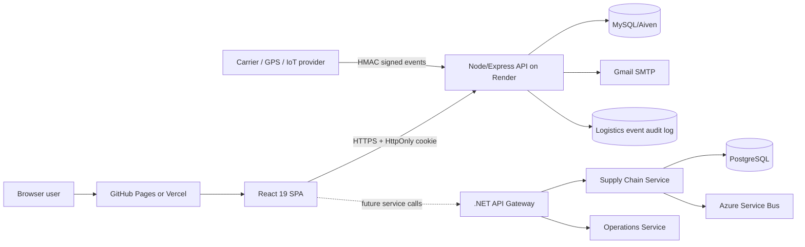
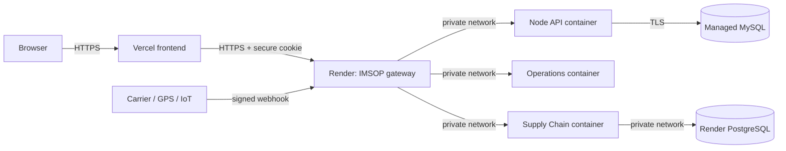
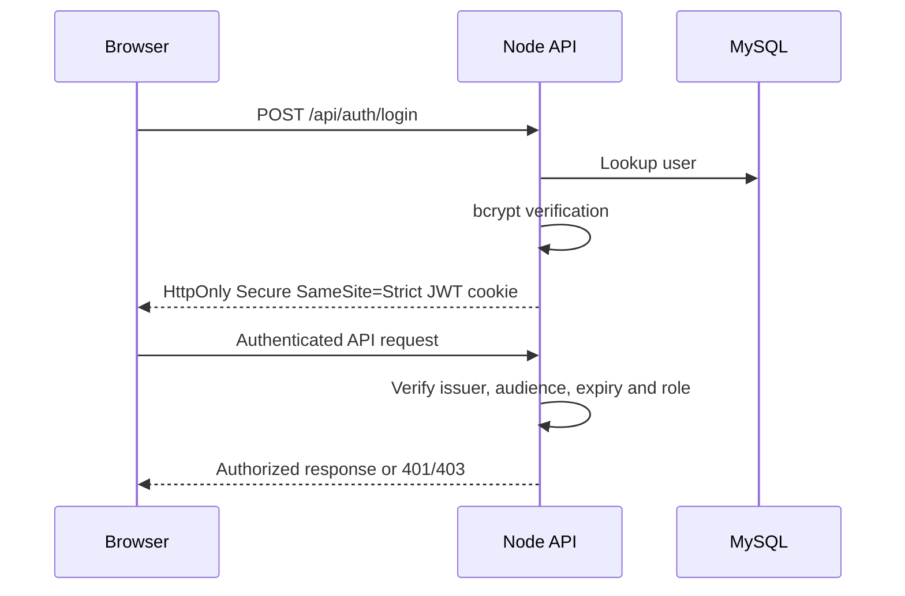

# IMSOP Architecture

## Repository ownership

| Repository | Responsibility |
|---|---|
| `imsop-app` | React/Vite frontend, browser tests, static frontend deployment |
| `imsop-app-backend` | Node API, .NET services, databases, migrations, infrastructure and backend CI/CD |

The React application currently uses the Node API as its browser-facing backend. The .NET services provide the supply-chain microservice foundation and protected order APIs. They share the same JWT issuer (`imsop-api`) and audience (`imsop-web`) but remain independently deployable.

## Runtime architecture

### Production topology

Only the gateway is public. Render private services isolate the application containers, while Vercel serves the compiled frontend. Gateway readiness verifies the downstream services before Render shifts production traffic.

## Authentication and authorization

Demo accounts use the frontend mock-auth adapter and browser storage. They never authenticate against production data. Real accounts use the Node API, bcrypt password hashes, 15-minute JWTs, and server-side role enforcement.

## Role matrix

| Area | Admin | Engineer | Analyst | User |
|---|:---:|:---:|:---:|:---:|
| Dashboard | ✓ | ✓ | ✓ | ✓ |
| Shipments | ✓ | ✓ | ✓ | ✓ |
| Orders | ✓ | ✓ | ✓ | — |
| Analytics | ✓ | — | ✓ | — |
| Infrastructure | ✓ | ✓ | — | — |
| Intelligence | ✓ | ✓ | ✓ | — |
| Telemetry read | ✓ | ✓ | ✓ | — |
| Telemetry ingest | ✓ | ✓ | — | — |

## Logistics ingestion

Providers send canonical events to `POST /api/integrations/logistics/{provider}/events`. Requests include a Unix timestamp and an HMAC-SHA256 signature of `timestamp.rawBody`. The API rejects timestamps older than five minutes, validates payloads, records each provider event once, and upserts the current shipment state. Provider/event IDs form the idempotency key.

## Availability

- `/health` verifies the process is running.
- `/ready` verifies the process and database connection.
- Render promotes new instances only after `/ready` succeeds and otherwise keeps the prior version live.
- Kubernetes uses rolling updates with zero unavailable replicas, readiness/liveness probes, revision history, and scripted rollback.

